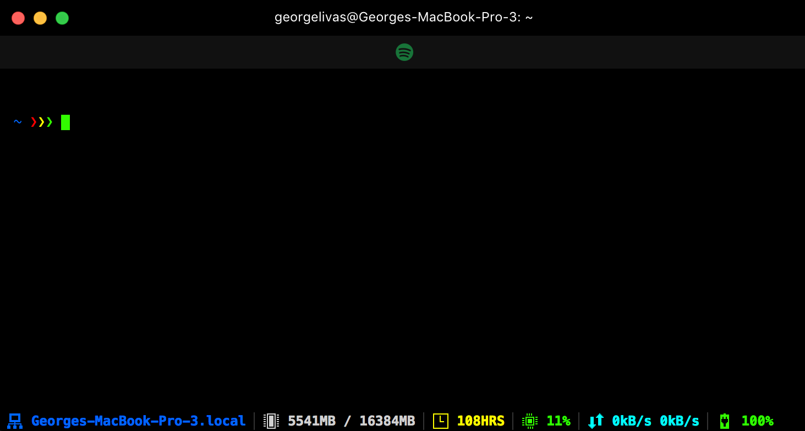

[](https://hyper.is)
# My Terminal Configuration [](https://github.com/zeit/hyper/releases/tag/1.3.3) [](https://georgelivas.github.io)
## Hyper.app Configuarion
I am using [Hyper](https://hyper.is/) terminal on Mac every day, so I customised it to fit my needs in terms of apearance and usage.

<br><br>

### Packages
>All packages below and many more can be found at the repo: [](https://github.com/sindresorhus/awesome) [Hyper](https://github.com/bnb/awesome-hyper)

Name     | Description
---------| -------------
[hyperline](https://www.npmjs.com/package/hyperline)                     | HyperLine is a status line plugin for Hyper.app. It shows you useful system information such as free memory, uptime and CPU usage.
[hyperlayout](https://www.npmjs.com/package/hyperlayout)                 | Layout presets for Hyper.app
[hyperterm_cursor](https://www.npmjs.com/package/hyperterm-cursor)       | Allows seeing the char behind your cursor by a color difference.
[hypergoogle](https://www.npmjs.com/package/hypergoogle)                 |   Open a Google search from the terminal.
[hyper-blink](https://www.npmjs.com/package/hyper-blink)                 | Make your cursor blink.
[hyper-spotify](https://www.npmjs.com/package/hyper-spotify)             | Display currently playing song on Spotify at the bottom or the top of the terminal and allows you to control your favourite music

#### Custom Theme for hyper-spotify
```javascript
hyperSpotify: {
   theme: 'custom',
   controlsPosition: 'default',
   position: 'top',
   overlayColor: '#fff',
   iconColor: '#D75C1B',
   spotifyIconColor: '#1ED760',
   textColor: '#1ED760',
   margin: 'double'
}
```
### Outcome


## Shell Configuaration 
[Oh-My-Zsh](http://ohmyz.sh/) is an open source, community-driven framework for managing your ZSH configuration. It comes bundled with a ton of helpful functions, helpers, plugins, themes, and a few things that make you shout...

### [](https://github.com/sorin-ionescu/prezto)

To install the theme:

1. You have to clone the repo [](https://github.com/sorin-ionescu/prezto) 
2. Create a new Zsh configuration by copying the Zsh configuration files
     provided:

	```sh
	setopt EXTENDED_GLOB
	for rcfile in "${ZDOTDIR:-$HOME}"/.zprezto/runcoms/^README.md(.N); do
	ln -s "$rcfile" "${ZDOTDIR:-$HOME}/.${rcfile:t}"
	done
	```


3. Set Zsh as your default shell:

	```console
	chsh -s /bin/zsh
	```

3. Open a new Zsh terminal window or tab.

## Acknowledgments
* [Hyper.app](https://hyper.is/)
* [Oh-My-Zsh](http://ohmyz.sh/)
* [Prezto Theme](https://github.com/sorin-ionescu/prezto)

